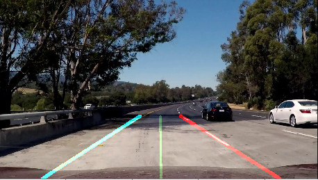
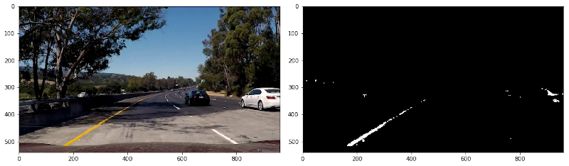
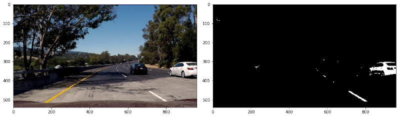
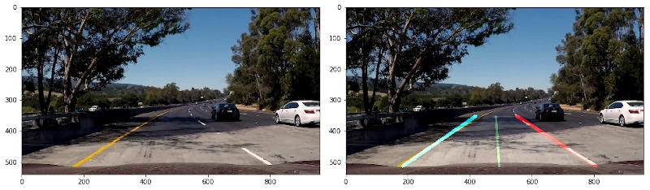

# **Finding Lane Lines on the Road** 

[](http://www.udacity.com/drive)



## Overview

When we drive, we use our eyes to decide where to go.  The lines on the road that show us where the lanes are act as our constant reference for where to steer the vehicle.  Naturally, one of the first things we would like to do in developing a self-driving car is to automatically detect lane lines using an algorithm.

In this project we will detect lane lines in images using Python and OpenCV.


## The Project

In order to create the environment required to reproduce the results of this notebook, an Anaconda/Conda environment file is given in `environment.yaml`.
A Conda environment can then be set up using

```bash
conda create env -f environment.yaml
```

The notebook [P1.ipynb](P1.ipynb) can then be opened in Jupyter Notebook using

```bash
conda activate carnd-term1
jupyter notebook P1.ipynb
```

## Project description

As stated above, the goal of this project is to detect street lane lines in video camera images using traditional computer vision approaches.
In order to achieve this goal, [the notebook ](P1.ipynb) a five step pipeline that is capable of
detecting the left and right lane lines separately, whereby a lane line is either

- yellow and solid,
- white and solid or
- white and dashed

In the first step, the the lane lines are segmented from the color image. To achieve this,
the image is converted from RGB to [HSL](https://en.wikipedia.org/wiki/HSL_and_HSV) (hue, saturation and lightness) color space, since this allows addressing pixels by either their color or their brightness.
To account for changes in illumination, the lightness channel is preprocessed using a adaptive histogram equalization ([CLAHE](https://en.wikipedia.org/wiki/Adaptive_histogram_equalization)), after which two
separate masks for the yellow and white lines are generated and combined for the later stage.




After thresholding, a region of interest is masked out from the image by applying a trapezoid
cut at the bottom half of the image. This follows the assumption that lane marks can always be found in the lower half
of the image and follow a triangular shape with the tip close to the center of the image due to perspective.
This assumption is somewhat limited in that steering action can (and will) break it, but it is an acceptable baseline to start with.


After masking, an edge image is obtained by applying Canny edge detection, reducing the lane lines to thin lines for further processing.


The edge image is now passed to a probabilistic Hough transform that detects line segments. A minimum line length is enforced and line
segments in a valid distance are merged. Lines not agreeing with a valid range of slopes are discarded and the resulting lines are
split by angle, extrapolated to a common length and averaged via their mean.


Finally, the lines are overlaid on the original image, adding a lane marker and center.



## Shortcomings of the approach

This processing pipeline only addresses single images, i.e. does not take into account temporal and spatiotemporal correlations,
and is engineered against a set of daylight images only. In order to test the validity of the approach, night images would have to
be evaluated as well.

Since the images are processed separately from each other even during processing of a video stream, massive jitter can occur
due to the stochastic nature of the probabilistic Hough transform, noise, and changing lighting and contrast conditions. To accomodate,
a low-level filter was added to the video processing part that effectively suppresses jumps between frames. This does come at its own
cost, but seems to do reasonably well for the given test videos.

While processing the challenge video, it was found that the "lightness" of the yellow lane lines is similar to that of the surrounding
concrete in some situations. This led to the addition of a separate mask attentive to yellow features only, after which the challenge was
easy to tackle. This does show the vulnerability of the whole approach quite well: Taking simple assumptions about the
scenario may lead to unforeseeable failures when the implementation meets new environments.
Since neither a measure for the accuracy of the algorithm nor ground truth information exist (as far as this project is concerned),
an accurate measure of the algorithm's quality is impossible.

